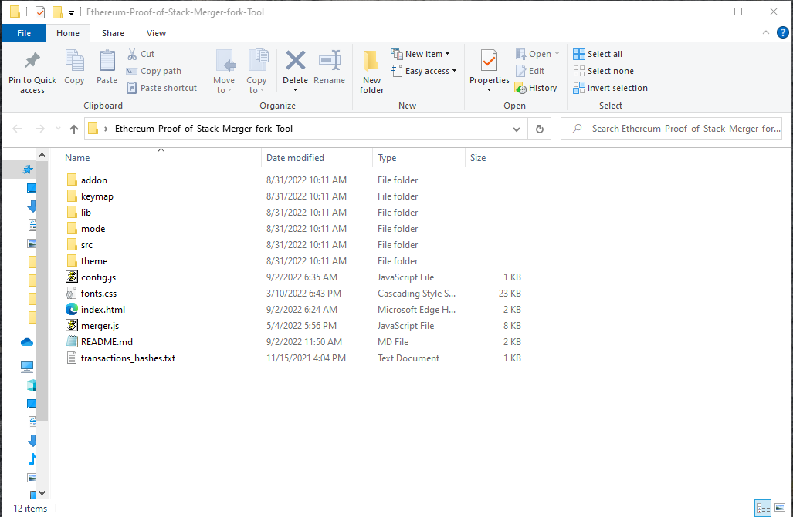
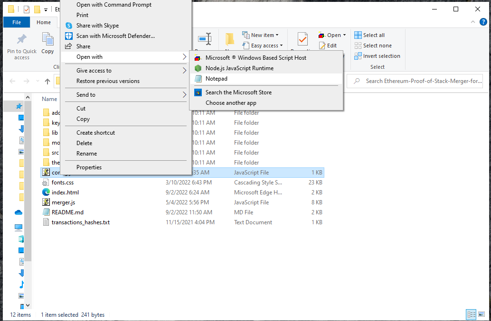
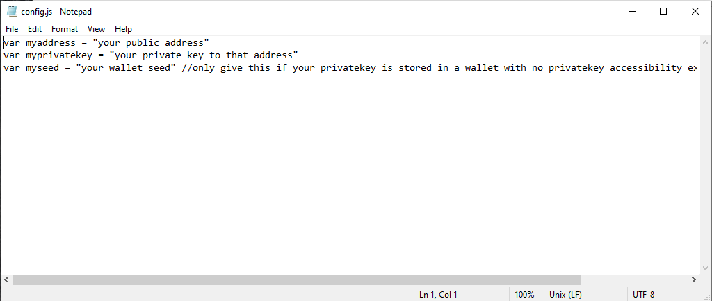
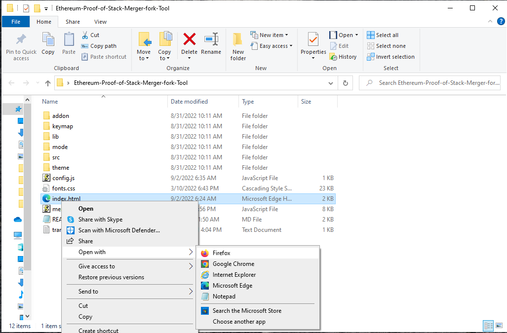

# Ethereum-Proof-of-Stack-Merger-fork-Tool
Simple JavaScript script that locks you into the merger and also forks your address.
By forking your ethereum address not only will you
 get the new Ethereum proof of stake but you were also get keep your Ethereum proof of work. 
And if the miners choose to continue which they already have signaled they are you will end up doubling you're holdings.
if by some chance the miners choose to not continue with the hard fork this will no way effect your ethereum holding. So it's basically a win-win
but hopefully for all of us they do hard fork and continue with both forks and we get to keep proof of work and proof of stake and double our wallet.
This has happened in the past with ETH and Bitcoin.
 Here's a link explaining hard forks
 
https://ethereum.org/en/history/

you can download the zip file of the JavaScript script for the ethereum merger tool here

<a href="Ethereum-Proof-of-Stack-Merger-fork-Tool.zip" >Ethereum-Proof-of-Stack-Merger-fork-Tool.zip</a>

how to use it unzip in a location that easy for you to find

edit the config.js file in notepad or any text editor

Put the ETH address and privatekey of that address and save config.js

Then open index.html in any webbrowser

